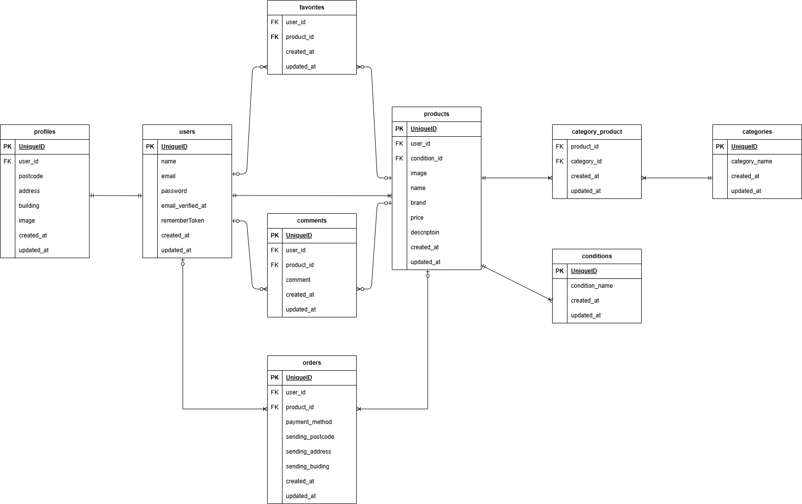

# flea-market(フリマ)

## 環境構築

**Docker ビルド**

1. `git@github.com:Meg0317/flea-market.git`
2. DockerDesktop アプリを立ち上げる
3. `docker-compose up -d --build`

**Laravel 環境構築**

1. `docker-compose exec php bash`
2. `composer install`
3. 新しく.env ファイルを作成し環境変数を変更
4. .env に以下の環境変数を追加

```text
   DB_CONNECTION=mysql
   DB_HOST=mysql
   DB_PORT=3306
   DB_DATABASE=laravel_db
   DB_USERNAME=laravel_user
   DB_PASSWORD=laravel_pass
```

5. アプリケーションキーの作成

```bash
php artisan key:generate
```

6. マイグレーションの実行

```bash
php artisan migrate
```

7. シーディングの実行

```bash
php artisan db:seed
```

## 環境構築(クローン)

**Docker ビルド**

1. クローンを作成する
2. `git@github.com:Meg0317/flea-market.git`
3. DockerDesktop アプリを立ち上げる
4. `docker-compose up -d --build`

**Laravel 環境構築(クローン)**

1. `docker-compose exec php bash`
2. `composer install`
3. 新しく.env ファイルを作成し環境変数を変更
4. .env に以下の環境変数を追加

```text
   DB_CONNECTION=mysql
   DB_HOST=mysql
   DB_PORT=3306
   DB_DATABASE=laravel_db
   DB_USERNAME=laravel_user
   DB_PASSWORD=laravel_pass
```

5. アプリケーションキーの作成

```bash
php artisan key:generate
```

6. マイグレーションの実行

```bash
php artisan migrate
```

7. シーディングの実行

```bash
php artisan db:seed
```

## 使用技術(実行環境)

- 7.4.9-fpm
- Laravel8.83.8
- MySQL8.0.26

## ER 図



## URL

- 開発環境：http://localhost/
- phpMyAdmin:：http://localhost:8080/
- mailhog：http://localhost:8025

## 補足

・一定時間経過するとログイン認証を求められる仕様です
・購入済みの商品は商品購入画面の購入ボタンを表示しないようにし、再購入できない仕様です
・COACHTECH のリンクをクリックするとホーム画面（商品一覧画面）に遷移します(戻るボタンがないため)
・ダミーユーザーを 3 名作成。出品情報は、user1 と user2 で各々分けてシーダーを作成しています。
　 user1:テストユーザー 1
　 user2:テストユーザー 2
　 user3:テストユーザー 3
